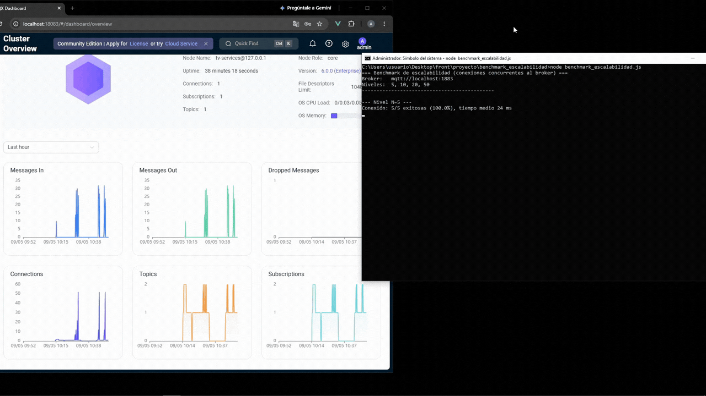

# Benchmark de Escalabilidad (MQTT)

Mide cómo se comporta el broker MQTT (EMQX) cuando aumenta la cantidad de conexiones concurrentes, sin necesitar hardware adicional: el script simula una "flota" de N clientes fantasma mientras mide el desempeño real del sistema.

Este repositorio forma parte del proyecto **Plataforma IoT**, desarrollado como trabajo de tesis de Ingeniería en Telecomunicaciones. El repositorio principal funciona como punto de acceso a la documentación general y a los distintos componentes del sistema: 🔗 https://github.com/adriangallicet/tesis-plataforma-iot


## Demo



## Objetivo

Complementa a [`rtt_benchmarkv2.js`](../rtt-benchmark), que mide el RTT en condiciones normales o de red degradada pero con una sola conexión activa.

Este benchmark responde una pregunta distinta: **¿el sistema sigue respondiendo igual de bien cuando hay muchos dispositivos conectados al mismo tiempo?**

Para eso, ante cada nivel de carga `N` mide tres cosas:

1. **Conexión**: cuántos de los N clientes fantasma logran conectarse y en cuánto tiempo.
2. **t_ack bajo carga**: el RTT comando→confirmación de un dispositivo real, con los N clientes fantasma ya conectados de fondo.
3. **Reconexión masiva**: se desconectan los N clientes de golpe (simulando una caída de red/broker) y se mide cuánto tardan en reconectar todos.

---

## Funcionamiento

Para cada nivel de carga configurado:

```text
Conectar N clientes fantasma
        ↓
Medir tiempo/tasa de éxito de conexión
        ↓
Medir t_ack del dispositivo real (varias veces, con la flota ya conectada)
        ↓
Desconectar los N clientes de golpe
        ↓
Medir cuánto tardan en reconectar todos
        ↓
Pasar al siguiente nivel de carga
```

Al finalizar todos los niveles, se muestra una tabla resumen por consola y se exporta un CSV con una fila por nivel.

---

## Tópicos MQTT

Usa el mismo esquema que `rtt_benchmarkv2.js`:

```text
userId/deviceId/actuatorId/actdata   → comando
userId/deviceId/actuatorId/sdata     → confirmación
```

---

## Métricas por nivel de carga

| Métrica | Qué indica |
|---|---|
| `conectados` / `tasaExitoConexion` | Cuántos clientes fantasma lograron conectarse al broker |
| `tiempoConexionMedioMs` | Tiempo medio que tardó cada cliente en conectarse |
| `tackMediaMs` / `tackP95Ms` | RTT del dispositivo real bajo esa carga (media y P95) |
| `tackTasaPerdida` | % de comandos al dispositivo real que no obtuvieron confirmación |
| `tiempoReconexionMasivaMs` | Tiempo en que reconectan todos los clientes tras una caída simultánea |

---

## Configuración

Se define mediante variables de entorno (todas opcionales, con valores por defecto):

| Variable | Descripción | Por defecto |
|---|---|---:|
| `MQTT_URL` | Dirección del broker | `mqtt://localhost:1883` |
| `MQTT_USERNAME` / `MQTT_PASSWORD` | Credenciales MQTT | `benchmark_escalabilidad` |
| `TEST_USER_ID` | Identificador del usuario | - |
| `TEST_DEVICE_ID` | Identificador del dispositivo | - |
| `TEST_ACTUATOR_ID` | Identificador del actuador | - |
| `TEST_NIVELES` | Niveles de carga a probar (N conexiones) | `5,10,20,50` |
| `TEST_MEDICIONES_POR_NIVEL` | Mediciones de t_ack por nivel | `20` |
| `TEST_TIMEOUT_CONEXION_MS` | Timeout de conexión | `10000 ms` |
| `TEST_TIMEOUT_ACK_MS` | Timeout de t_ack | `10000 ms` |
| `TEST_DELAY_MS` | Espera entre mediciones de t_ack | `500 ms` |

`userId`, `deviceId` y `actuatorId` son obligatorios: el script no arranca si detecta el valor por defecto `REEMPLAZAR_...`.

---

## Ejecución

```bash
npm init -y
npm install mqtt

TEST_USER_ID=xxx TEST_DEVICE_ID=xxx TEST_ACTUATOR_ID=xxx node benchmark_escalabilidad.js
```

También puede ajustarse cualquier otro parámetro por variable de entorno, por ejemplo:

```bash
TEST_NIVELES=10,50,100 TEST_MEDICIONES_POR_NIVEL=30 node benchmark_escalabilidad.js
```

Se recomienda no versionar `node_modules/` (agregar a `.gitignore`).

---

## Resultado en consola

```text
--- Nivel N=20 ---
Conexión: 20/20 exitosas (100.0%), tiempo medio 11 ms
t_ack bajo carga: media 108.7 ms, P95 130 ms, pérdida 0.0%
Forzando desconexión masiva para medir tiempo de reconexión...
Tiempo de reconexión masiva (20 clientes): 1024 ms
```

Y al final, una tabla resumen con todos los niveles probados.

---

## Archivo CSV

Cada ejecución genera `escalabilidad_resultados_<timestamp>.csv`, con una fila por nivel de carga:

```csv
n;conectados;tasa_exito_conexion_pct;tiempo_conexion_medio_ms;tack_media_ms;tack_p95_ms;tack_tasa_perdida_pct;tiempo_reconexion_masiva_ms
5;5;100.0;24;105.3;116;0.0;1016
10;10;100.0;7;112.0;140;0.0;1016
20;20;100.0;11;108.7;130;0.0;1024
50;50;100.0;28;106.4;115;0.0;1047
```

Esto permite graficar cómo evolucionan las métricas a medida que aumenta la cantidad de conexiones.

---

## Limitaciones

- El benchmark corre desde una sola máquina: a partir de cierto N, el propio cliente (CPU, sockets, ancho de banda) puede convertirse en el cuello de botella en lugar del broker.
- Los clientes fantasma no envían tráfico de aplicación real, solo mantienen la conexión abierta: miden el costo de **tener conexiones activas**, no el de **tráfico** a esa escala.
- Al igual que en `rtt_benchmarkv2.js`, el t_ack medido es un tiempo extremo a extremo y no aísla por sí solo qué componente (broker, red, dispositivo) domina la degradación observada.

---

## Propósito dentro del proyecto

Este benchmark complementa la caracterización de RTT en condiciones normales, agregando la dimensión de **escalabilidad**: permite estimar hasta qué cantidad de conexiones concurrentes el sistema mantiene un desempeño aceptable antes de degradarse.
